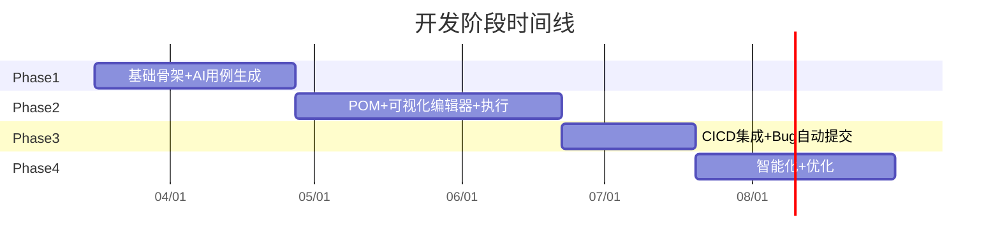

# AI 自动化测试平台 — 开发计划与任务列表

基于 [architecture.md](docs/architecture.md)、[database-design.md](docs/database-design.md)、[api-contracts.md](docs/api-contracts.md)、[visual-editor-design.md](docs/visual-editor-design.md)、[deployment-guide.md](docs/deployment-guide.md) 5 份设计文档，拆解为 4 个阶段、5 条并行工作线的具体开发任务。

---

## 整体时间线

## 工作线划分

- **[Go]** Go 主后端（API、调度、数据管理）
- **[Py-AI]** Python AI 微服务（LLM、生成、分析）
- **[Py-Exec]** Python 测试执行 Worker（Playwright、报告）
- **[FE]** React 前端
- **[Infra]** 基础设施（数据库、MQ、Docker、CI）

---

## Phase 1：基础骨架 + AI 用例生成（6 周）

**里程碑目标**：跑通 "输入需求 -> AI 生成用例 -> 人工审核" 闭环

### Week 1-2：项目骨架与基础设施

| ID   | 工作线     | 任务                                                                                                 | 产出                    | 依赖       |
| ---- | ------- | -------------------------------------------------------------------------------------------------- | --------------------- | -------- |
| 1.1  | [Infra] | 初始化 Monorepo 目录结构，创建 `backend/`、`ai_service/`、`test_executor/`、`frontend/`、`proto/`、`deploy/`      | 项目骨架                  | -        |
| 1.2  | [Infra] | 编写 `docker-compose.yml`，配置 PostgreSQL、Redis、RabbitMQ、MinIO                                         | 基础设施可一键启动             | -        |
| 1.3  | [Infra] | 编写 Protobuf 定义（`common.proto`、`ai_service.proto`、`executor_service.proto`），配置 `make proto`         | Go + Python gRPC 代码生成 | 1.1      |
| 1.4  | [Infra] | 编写 Makefile（proto/dev/infra/migrate/down/logs/test 命令）                                             | 统一构建命令                | 1.1      |
| 1.5  | [Go]    | 初始化 Go 项目（go mod init），搭建 Gin 框架骨架（config/server/router/middleware）                                | Go 服务可启动              | 1.1      |
| 1.6  | [Go]    | 编写 Migration SQL：`users`、`projects`、`requirements`、`test_cases`、`async_tasks` 表 + `updated_at` 触发器 | 核心表就绪                 | 1.5      |
| 1.7  | [Go]    | 实现用户模块：注册/登录/JWT 认证/角色权限中间件                                                                        | 认证体系                  | 1.5, 1.6 |
| 1.8  | [Go]    | 实现项目管理 CRUD API（`/api/v1/projects`）                                                                | 项目管理可用                | 1.7      |
| 1.9  | [Go]    | 实现统一响应格式、错误码体系、链路追踪（trace_id）                                                                      | API 基础规范              | 1.5      |
| 1.10 | [Py-AI] | 初始化 Python AI 项目，搭建 gRPC Server + MQ Consumer 框架                                                   | AI 服务可启动              | 1.1, 1.3 |
| 1.11 | [FE]    | 初始化 React + TypeScript + Ant Design Pro 项目                                                         | 前端可启动                 | 1.1      |

### Week 3-4：需求管理 + AI 用例生成

| ID   | 工作线     | 任务                                                                                | 产出          | 依赖             |
| ---- | ------- | --------------------------------------------------------------------------------- | ----------- | -------------- |
| 1.12 | [Go]    | 实现需求管理 CRUD API（`/api/v1/projects/:pid/requirements`）                             | 需求管理可用      | 1.8            |
| 1.13 | [Go]    | 实现异步任务框架：TaskDispatcher + MQ Publisher + async_tasks 表状态管理                        | 任务分发能力      | 1.5, 1.2       |
| 1.14 | [Go]    | 实现 MQ 结果消费者：监听 `results.ai` 队列，更新任务状态                                             | 结果回调链路      | 1.13           |
| 1.15 | [Go]    | 实现生成用例触发 API（`POST /requirements/:id/generate-cases`）                             | 可触发 AI 生成   | 1.12, 1.13     |
| 1.16 | [Go]    | 实现 WebSocket Hub，支持向前端推送任务进度                                                      | 实时推送能力      | 1.5            |
| 1.17 | [Py-AI] | 实现 LLM 客户端封装（支持 OpenAI/Claude，统一接口，重试/降级）                                         | LLM 调用能力    | 1.10           |
| 1.18 | [Py-AI] | 编写用例生成 Prompt v1（需求描述 -> 结构化测试用例 JSON）                                            | 用例生成 Prompt | 1.17           |
| 1.19 | [Py-AI] | 实现 MQ Consumer：消费 `ai.generate.cases`，调用 LLM，写入 `test_cases` 表，发布结果到 `results.ai` | AI 用例生成闭环   | 1.17, 1.18     |
| 1.20 | [Py-AI] | 实现 `llm_usage_logs` 记录：每次调用记录 token/费用/耗时                                         | LLM 用量追踪    | 1.17           |
| 1.21 | [FE]    | 实现登录页面 + 项目列表页 + 项目创建                                                             | 基础页面框架      | 1.11, 1.7, 1.8 |
| 1.22 | [FE]    | 实现需求管理页面（列表/创建/编辑/详情）                                                             | 需求管理 UI     | 1.21, 1.12     |

### Week 5-6：用例管理 + 审核 + 联调

| ID   | 工作线     | 任务                                            | 产出         | 依赖         |
| ---- | ------- | --------------------------------------------- | ---------- | ---------- |
| 1.23 | [Go]    | 实现测试用例 CRUD API + 审核接口（approve/reject） + 批量审核 | 用例管理 API   | 1.6        |
| 1.24 | [Go]    | 实现异步任务查询 API（`GET /tasks/:id`）                | 任务状态查询     | 1.13       |
| 1.25 | [FE]    | 实现"触发 AI 生成用例"按钮 + WebSocket 进度监听 + 进度提示      | AI 生成交互    | 1.15, 1.16 |
| 1.26 | [FE]    | 实现用例列表页（按模块/优先级/状态筛选）                         | 用例浏览       | 1.23       |
| 1.27 | [FE]    | 实现用例审核界面（查看详情、编辑步骤、审批/驳回）                     | 人工审核闭环     | 1.23       |
| 1.28 | [Py-AI] | Prompt 调优：根据实际生成结果迭代 Prompt v1，提升质量           | 更好的生成效果    | 1.19       |
| 1.29 | [Infra] | Phase 1 端到端联调测试：需求录入 -> AI 生成 -> 用例审核全流程验证    | Phase 1 交付 | 全部         |

**Phase 1 交付物**：可运行的平台，支持需求录入、AI 自动生成测试用例、人工审核。

---

## Phase 2：POM + 可视化编辑器 + 手动执行（8 周）

**里程碑目标**：跑通 "用例 -> POM -> 可视化脚本 -> 手动执行 -> 报告" 闭环

### Week 7-8：元素仓库 + POM 生成

| ID  | 工作线     | 任务                                                                                                                                                                                                                                             | 产出         | 依赖        |
| --- | ------- | ---------------------------------------------------------------------------------------------------------------------------------------------------------------------------------------------------------------------------------------------- | ---------- | --------- |
| 2.1 | [Go]    | Migration：新增 `element_repository`、`page_objects`、`test_scripts`（含 steps_json）、`shared_components`、`test_suites`、`suite_scripts`、`test_datasets`、`environment_configs`、`tags`、`resource_tags`、`script_versions`、`audit_logs`、`llm_usage_logs` 表 | 全部表就绪      | 1.6       |
| 2.2 | [Go]    | 实现元素仓库 CRUD API（`/projects/:pid/elements`）                                                                                                                                                                                                     | 元素管理 API   | 2.1       |
| 2.3 | [Go]    | 实现 POM CRUD API（`/projects/:pid/page-objects`）                                                                                                                                                                                                 | POM 管理 API | 2.1       |
| 2.4 | [Py-AI] | 实现页面元素爬取器（Playwright 打开页面，提取所有可交互元素）                                                                                                                                                                                                           | 页面爬取能力     | 1.10      |
| 2.5 | [Py-AI] | 实现 POM 生成 Prompt + MQ Consumer（消费 `ai.generate.pom`）                                                                                                                                                                                           | AI 生成 POM  | 2.4, 1.17 |
| 2.6 | [FE]    | 实现元素仓库管理页面（列表/添加/编辑/验证定位器）                                                                                                                                                                                                                     | 元素管理 UI    | 2.2       |
| 2.7 | [FE]    | 实现 POM 管理页面（列表/详情/在线查看源码）                                                                                                                                                                                                                      | POM 管理 UI  | 2.3       |

### Week 9-10：可视化脚本编辑器核心

| ID   | 工作线       | 任务                                                            | 产出         | 依赖   |
| ---- | --------- | ------------------------------------------------------------- | ---------- | ---- |
| 2.8  | [Go]      | 实现脚本 CRUD API（支持 script_type: visual/code，保存 steps_json）      | 脚本管理 API   | 2.1  |
| 2.9  | [Go]      | 实现脚本版本历史 API（`/scripts/:id/versions`、`/scripts/:id/rollback`） | 版本管理 API   | 2.1  |
| 2.10 | [Py-AI]   | 修改脚本生成 Prompt：输出 JSON 步骤模型（参照 visual-editor-design.md 格式）     | AI 输出可视化格式 | 1.17 |
| 2.11 | [Py-AI]   | 实现 MQ Consumer：消费 `ai.generate.script`，生成 JSON 步骤模型           | AI 脚本生成闭环  | 2.10 |
| 2.12 | [Py-Exec] | 实现 JSON -> Playwright Python 代码转换器（`StepConverter`）           | 核心转换引擎     | -    |
| 2.13 | [FE]      | 实现可视化编辑器：步骤卡片组件（每种 type 一个卡片模板）                               | 编辑器基础组件    | -    |
| 2.14 | [FE]      | 实现可视化编辑器：操作类型选择器（导航/交互/等待/断言/数据下拉菜单）                          | 操作选择       | 2.13 |
| 2.15 | [FE]      | 实现可视化编辑器：定位器编辑器（locator_type 下拉 + 值输入 + 选项配置）                 | 定位器编辑      | 2.13 |
| 2.16 | [FE]      | 实现可视化编辑器：断言编辑器（assert_type 选择 + 参数配置）                         | 断言编辑       | 2.13 |
| 2.17 | [FE]      | 实现可视化编辑器：条件（IF/ELSE）和循环（FOR EACH/COUNT/WHILE）嵌套卡片             | 流程控制       | 2.13 |
| 2.18 | [FE]      | 实现可视化编辑器：拖拽排序（含拖入/拖出嵌套容器）                                     | 步骤排序       | 2.13 |
| 2.19 | [FE]      | 实现可视化编辑器：变量管理面板 + `{{variable}}` 引用                           | 变量系统       | 2.13 |
| 2.20 | [FE]      | 实现可视化编辑器：步骤操作菜单（复制/禁用/备注/断点/删除） + 撤销重做                        | 编辑操作       | 2.13 |

### Week 11-12：辅助功能 + 数据管理

| ID   | 工作线       | 任务                                                   | 产出         | 依赖   |
| ---- | --------- | ---------------------------------------------------- | ---------- | ---- |
| 2.21 | [Go]      | 实现标签 CRUD API + 资源标签绑定/解绑                            | 标签系统 API   | 2.1  |
| 2.22 | [Go]      | 实现公共组件 CRUD API（`/projects/:pid/components`） + 引用查询  | 组件管理 API   | 2.1  |
| 2.23 | [Go]      | 实现测试数据集 CRUD API（`/projects/:pid/datasets`） + CSV 导入 | 数据集 API    | 2.1  |
| 2.24 | [Go]      | 实现环境配置 CRUD API（`/projects/:pid/env-configs`）        | 环境配置 API   | 2.1  |
| 2.25 | [Go]      | 实现元素定位器验证接口（`POST /elements/verify`）                 | 定位器验证      | 2.2  |
| 2.26 | [FE]      | 实现元素拾取器（打开浏览器预览，点选元素，返回定位器）                          | 元素拾取       | 2.25 |
| 2.27 | [FE]      | 实现公共组件管理页面 + 编辑器中 `call_component` 步骤                | 组件复用       | 2.22 |
| 2.28 | [FE]      | 实现测试数据集管理页面（表格编辑 + CSV 导入）                           | 数据集 UI     | 2.23 |
| 2.29 | [FE]      | 实现标签管理 + 脚本/用例标签绑定                                   | 标签 UI      | 2.21 |
| 2.30 | [FE]      | 实现环境配置管理页面                                           | 环境配置 UI    | 2.24 |
| 2.31 | [Py-Exec] | 初始化 test-worker 项目，实现 MQ Consumer 框架                 | Worker 可启动 | 1.1  |

### Week 13-14：执行引擎 + 录制调试 + 报告

| ID   | 工作线       | 任务                                                             | 产出         | 依赖         |
| ---- | --------- | -------------------------------------------------------------- | ---------- | ---------- |
| 2.32 | [Go]      | 实现测试套件 CRUD API + 套件关联脚本 + 套件触发执行                              | 套件管理 API   | 2.1        |
| 2.33 | [Go]      | 实现执行管理 API（创建/取消/查询进度/查询结果）                                    | 执行管理 API   | 2.1        |
| 2.34 | [Go]      | 实现审计日志中间件（自动记录所有写操作到 `audit_logs`）                             | 审计日志       | 2.1        |
| 2.35 | [Py-Exec] | 实现工作空间管理：从 DB 拉取脚本 + POM -> 组装独立工作目录 -> 生成 conftest.py         | 执行前准备      | 2.31, 2.12 |
| 2.36 | [Py-Exec] | 实现测试运行器：调用 pytest + playwright，支持多浏览器/并行/重试/超时                 | 核心执行能力     | 2.35       |
| 2.37 | [Py-Exec] | 实现结果收集器：解析 pytest 结果，写入 `execution_results`，上传截图/Trace 到 MinIO | 结果收集       | 2.36       |
| 2.38 | [Py-Exec] | 实现 Allure 报告生成 + 上传到 MinIO                                     | 报告生成       | 2.37       |
| 2.39 | [Py-Exec] | 实现数据驱动执行：读取 `test_datasets`，按行参数化执行                            | 数据驱动       | 2.36       |
| 2.40 | [FE]      | 实现录制回放功能（启动浏览器 -> 录制操作 -> 转为 JSON 步骤）                          | 脚本录制       | 2.13       |
| 2.41 | [FE]      | 实现单步调试模式（调试面板 + WebSocket 事件监听 + 实时截图）                         | 脚本调试       | 2.13, 1.16 |
| 2.42 | [FE]      | 实现测试套件管理页面                                                     | 套件 UI      | 2.32       |
| 2.43 | [FE]      | 实现执行中心页面（创建执行/选择套件/配置参数/查看进度）                                  | 执行 UI      | 2.33       |
| 2.44 | [FE]      | 实现报告中心页面（Allure 报告嵌入/通过率趋势图）                                   | 报告 UI      | 2.38       |
| 2.45 | [Infra]   | Phase 2 端到端联调：需求 -> 用例 -> POM -> 可视化脚本 -> 执行 -> 报告 全流程         | Phase 2 交付 | 全部         |

**Phase 2 交付物**：可视化脚本编辑器完整可用，支持录制/拾取/调试，执行引擎可运行并生成 Allure 报告。

---

## Phase 3：CI/CD 集成 + Bug 自动提交（4 周）

**里程碑目标**：CI 触发 -> 自动执行 -> 自动提 Bug -> 通知的全自动闭环

### Week 15-16：Webhook + 增量测试

| ID  | 工作线     | 任务                                                                           | 产出         | 依赖        |
| --- | ------- | ---------------------------------------------------------------------------- | ---------- | --------- |
| 3.1 | [Go]    | 实现 GitLab/GitHub Webhook 接收（`POST /webhooks/gitlab`、`POST /webhooks/github`） | Webhook 接入 | 2.33      |
| 3.2 | [Go]    | 实现变更影响分析：解析 diff 文件 -> 映射到业务模块 -> 筛选关联测试用例/脚本                                | 增量测试选择     | 3.1       |
| 3.3 | [Go]    | 实现定时执行调度（cron）：每日全量回归、自定义定时任务                                                | 定时执行       | 2.33      |
| 3.4 | [Py-AI] | 实现 gRPC AnalyzeFailure：AI 分析测试失败原因（根因、建议、分类）                                 | 失败分析能力     | 1.17      |
| 3.5 | [Go]    | 实现失败分析调用：执行完成后，对 failed 用例调用 gRPC AnalyzeFailure                             | 失败分析集成     | 3.4, 2.37 |

### Week 17-18：Bug 提交 + 通知 + 联调

| ID   | 工作线     | 任务                                                        | 产出            | 依赖            |
| ---- | ------- | --------------------------------------------------------- | ------------- | ------------- |
| 3.6  | [Go]    | 实现 JIRA 客户端：自动创建 Bug（标题、描述、优先级、附件）                        | JIRA 集成       | 3.5           |
| 3.7  | [Go]    | 实现 Bug 去重逻辑：基于错误信息 + 页面 + 元素匹配已有 Bug                      | 防重复提交         | 3.6           |
| 3.8  | [Go]    | 实现通知模块：钉钉 Webhook / 企业微信 Webhook / 邮件 SMTP                | 多渠道通知         | -             |
| 3.9  | [Go]    | 实现执行完成后自动流程：生成报告 -> 分析失败 -> 创建 Bug -> 发送通知                | 自动化闭环         | 3.5, 3.6, 3.8 |
| 3.10 | [FE]    | 实现 Webhook 配置页面（添加/编辑/测试 Webhook）                         | Webhook 配置 UI | 3.1           |
| 3.11 | [FE]    | 实现 Bug 报告页面（查看自动创建的 Bug 列表、关联执行结果）                        | Bug 管理 UI     | 3.6           |
| 3.12 | [FE]    | 实现通知配置页面（钉钉/企微/邮件渠道配置）                                    | 通知配置 UI       | 3.8           |
| 3.13 | [FE]    | 实现 Dashboard 数据大盘（项目概览、执行趋势、通过率、AI 使用量）                   | 数据大盘          | 2.44          |
| 3.14 | [Infra] | CI/CD 流水线配置模板（`.gitlab-ci.yml` / GitHub Actions workflow） | CI 模板         | 3.1           |
| 3.15 | [Infra] | Phase 3 端到端联调：代码提交 -> Webhook -> 自动执行 -> 报告 -> Bug -> 通知  | Phase 3 交付    | 全部            |

**Phase 3 交付物**：CI/CD 全自动闭环，代码提交自动触发测试，失败自动提 Bug 并通知。

---

## Phase 4：智能化 + 优化（6 周，持续迭代）

**里程碑目标**：提升 AI 质量、平台稳定性和运营效率

### Week 19-20：Self-Healing + LLM 优化

| ID  | 工作线     | 任务                                                       | 产出      | 依赖   |
| --- | ------- | -------------------------------------------------------- | ------- | ---- |
| 4.1 | [Py-AI] | 实现 Self-Healing：定位器失败时自动尝试 fallback_locators，成功后更新主定位器   | 智能修复    | 2.12 |
| 4.2 | [Py-AI] | 实现页面变更自动检测：定期爬取页面，对比元素快照，发现变化通知                          | 变更感知    | 2.4  |
| 4.3 | [Py-AI] | 实现 gRPC SuggestLocator：AI 推荐更稳定的定位方式                     | 定位器建议   | 1.17 |
| 4.4 | [Py-AI] | 实现多模型任务分配：不同任务类型自动路由到不同模型                                | 成本优化    | 1.17 |
| 4.5 | [Go]    | 实现 LLM 用量统计 API（`/llm-usage/summary`、`/llm-usage/trend`） | 成本可视化   | 1.20 |
| 4.6 | [FE]    | 实现 LLM 成本仪表盘（Token 趋势、费用分布、模型占比）                         | 成本管理 UI | 4.5  |

### Week 21-22：版本管理 + 审计 + 归档

| ID   | 工作线     | 任务                                          | 产出      | 依赖   |
| ---- | ------- | ------------------------------------------- | ------- | ---- |
| 4.7  | [FE]    | 实现脚本版本历史页面（版本列表、diff 对比、一键回滚）               | 版本管理 UI | 2.9  |
| 4.8  | [FE]    | 实现审计日志页面（按用户/操作/资源/时间筛选）                    | 审计日志 UI | 2.34 |
| 4.9  | [Go]    | 实现归档/回收站机制：DELETE API 统一改为归档，回收站恢复/永久删除     | 数据安全    | -    |
| 4.10 | [FE]    | 实现回收站页面                                     | 回收站 UI  | 4.9  |
| 4.11 | [Py-AI] | Prompt 持续优化 + A/B 测试框架：同时运行两个版本 Prompt，对比效果 | AI 质量提升 | 1.18 |
| 4.12 | [Py-AI] | AI 反馈闭环：收集人工修改记录，构建 Few-shot 示例库            | 持续学习    | 4.11 |

### Week 23-24：监控 + 部署 + 性能

| ID   | 工作线       | 任务                                                    | 产出     | 依赖   |
| ---- | --------- | ----------------------------------------------------- | ------ | ---- |
| 4.13 | [Infra]   | 配置 Prometheus + Grafana：各服务暴露 /metrics，创建监控 Dashboard | 服务监控   | -    |
| 4.14 | [Infra]   | 配置 Loki 日志收集：统一 JSON 日志格式，Grafana 日志查询                | 日志中心   | -    |
| 4.15 | [Infra]   | AlertManager 告警规则：服务宕机、MQ 堆积、AI 失败率、通过率骤降             | 告警体系   | 4.13 |
| 4.16 | [Infra]   | 编写 Kubernetes 部署 YAML（Deployment/Service/Ingress/HPA） | K8s 部署 | -    |
| 4.17 | [Go]      | 性能优化：数据库查询优化、连接池调优、API 缓存策略                           | 性能提升   | -    |
| 4.18 | [Py-Exec] | 执行引擎优化：Worker 并发调优、浏览器复用、结果流式上报                       | 执行效率   | -    |

**Phase 4 交付物**：Self-Healing 智能修复、LLM 成本管控、完整的监控告警体系、K8s 生产部署。

---

## 关键里程碑汇总

| 里程碑            | 时间节点             | 验收标准                          |
| -------------- | ---------------- | ----------------------------- |
| **M1: MVP 可用** | Phase 1 结束 (W6)  | 需求 -> AI 生成用例 -> 人工审核 闭环跑通    |
| **M2: 核心功能完整** | Phase 2 结束 (W14) | 可视化编辑器 + 执行 + 报告 全流程跑通        |
| **M3: 全自动闭环**  | Phase 3 结束 (W18) | CI 触发 -> 执行 -> Bug -> 通知 自动完成 |
| **M4: 生产就绪**   | Phase 4 结束 (W24) | 监控告警 + K8s 部署 + 性能达标          |

## 任务统计

| 工作线       | Phase 1 | Phase 2 | Phase 3 | Phase 4 | 合计     |
| --------- | ------- | ------- | ------- | ------- | ------ |
| [Go]      | 10      | 10      | 7       | 3       | **30** |
| [Py-AI]   | 5       | 3       | 1       | 5       | **14** |
| [Py-Exec] | 0       | 6       | 0       | 1       | **7**  |
| [FE]      | 4       | 14      | 4       | 4       | **26** |
| [Infra]   | 5       | 1       | 2       | 4       | **12** |
| **合计**    | **24**  | **34**  | **14**  | **17**  | **89** |

