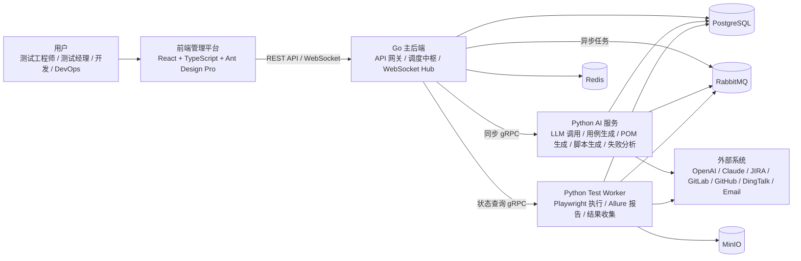
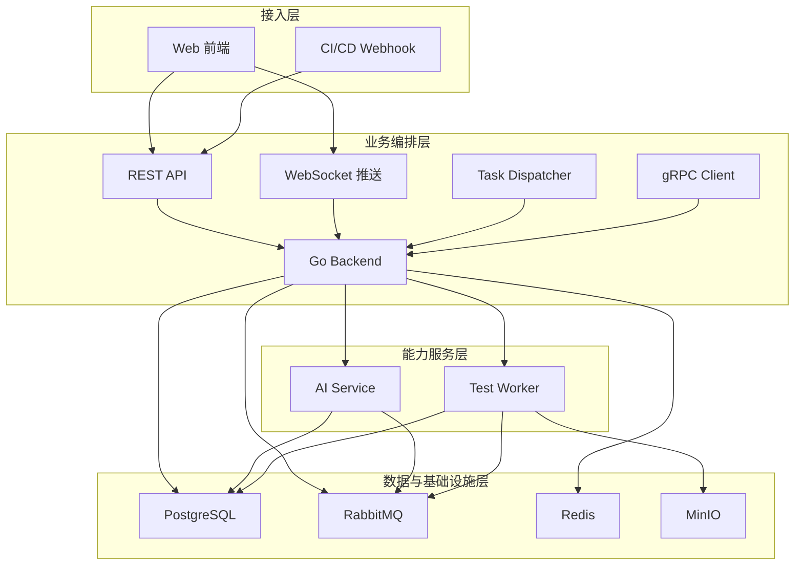
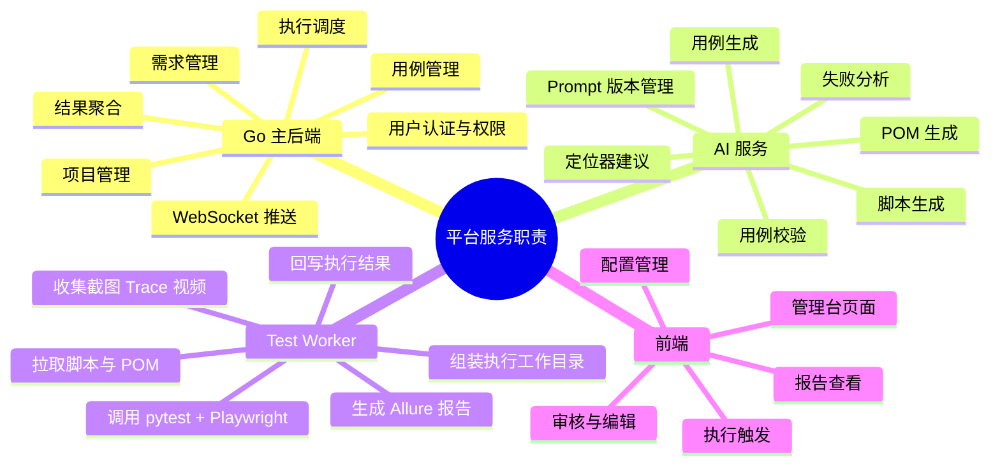
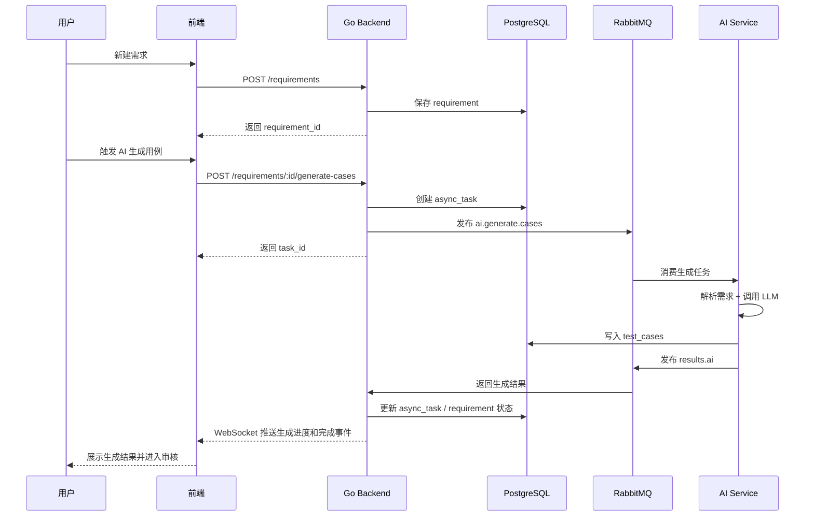
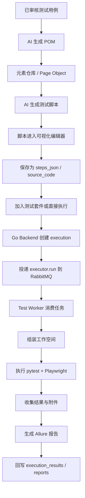
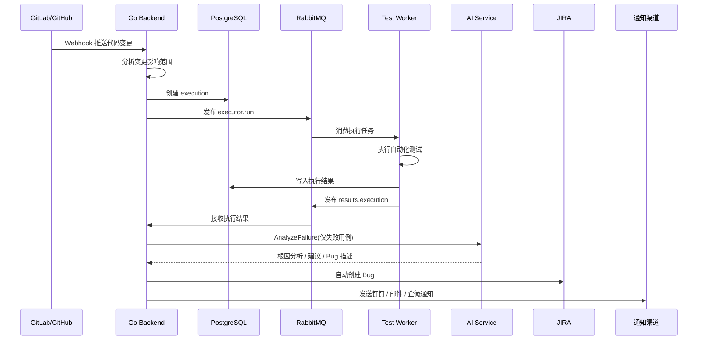
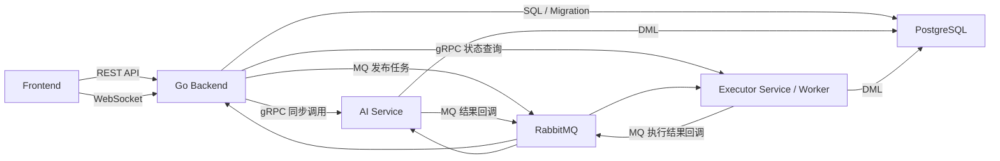
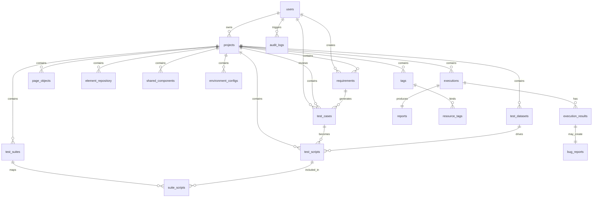
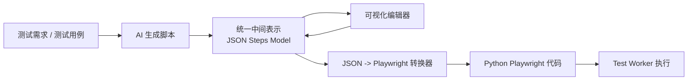
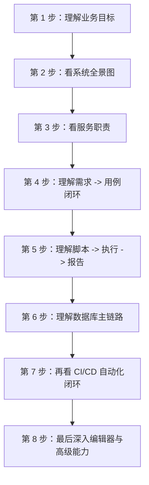

# AI 自动化测试平台图解

> 目的：基于现有设计文档，整理出更适合学习和讲解的系统架构图与流程图。  
> 适用场景：项目 onboarding、方案评审、架构复盘、开发前统一认知。

---

## 1. 系统全景图

这个图适合先建立“谁和谁交互”的整体印象：
- 前端只直接连 Go 后端。
- Go 是编排中心，不直接执行 Playwright，也不直接承载主要 AI 逻辑。
- AI 服务和执行 Worker 各自承担专门职责，通过 MQ/gRPC 与 Go 协作。

---

## 2. 分层架构图

这一层图更适合解释设计原则：
- 接入统一收口到 Go。
- 复杂耗时动作下沉到 Python 服务。
- 基础设施是共享资源，不是业务入口。

---

## 3. 服务职责图

---

## 4. 需求到用例的核心闭环

这个闭环是系统最早应该打通的 MVP 主线，也是最适合新人先理解的一条业务路径。

---

## 5. 用例到脚本到执行的主流程

---

## 6. CI/CD 自动化闭环

这个流程体现了平台最终目标：把测试从“手工触发”升级成“代码变更驱动的自动反馈系统”。

---

## 7. 通信方式图

可以用这张图快速解释为什么系统里同时存在 REST、WebSocket、gRPC、MQ：
- `REST` 负责页面请求
- `WebSocket` 负责实时进度
- `gRPC` 负责低延迟同步能力调用
- `MQ` 负责耗时任务解耦

---

## 8. 数据模型总览图

如果只是理解业务主线，建议优先记住这一条：

`Project -> Requirement -> Test Case -> Test Script -> Execution -> Report/Bug`

---

## 9. 脚本编辑器内部模型流转图

这张图有助于理解为什么 `steps_json` 是核心：
- AI 输出不是直接给“最终代码”，而是先给统一 JSON 模型。
- 可视化编辑和执行都围绕同一份中间表示展开。

---

## 10. 学习顺序建议图

推荐的阅读顺序：
- 先读这份图解
- 再读 [architecture.md](/Users/xianming.huang/GoProject/auto_test/docs/architecture.md)
- 然后读 [database-design.md](/Users/xianming.huang/GoProject/auto_test/docs/database-design.md)
- 最后读 [visual-editor-design.md](/Users/xianming.huang/GoProject/auto_test/docs/visual-editor-design.md) 和 [api-contracts.md](/Users/xianming.huang/GoProject/auto_test/docs/api-contracts.md)

---

## 11. 一句话总结

这个系统本质上是一个以 Go 为调度中心、以 Python 承担 AI 与自动化执行能力、以消息队列解耦耗时任务、以统一数据模型和可视化编辑器承接业务协作的 AI 自动化测试平台。
